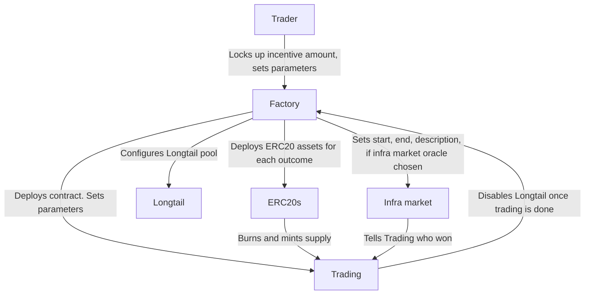
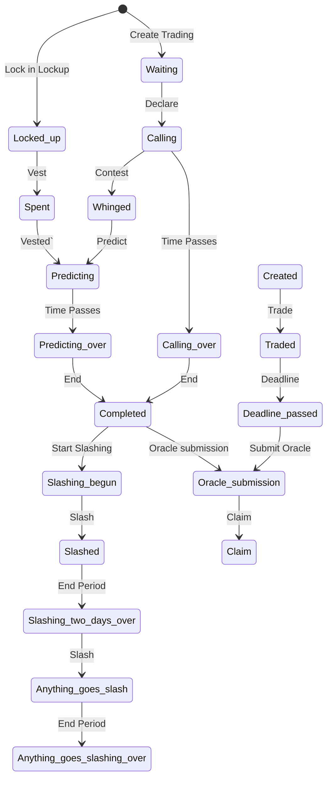

# 9Lives

9Lives is an Arbitrum Stylus smart contract implemented with a simple factory/pair
pattern. A factory takes a list of outcomes, and creates a variable number of contracts
with a minimal viable proxy pointing to share ERC20s, and a trading contract.

Inventors create campaigns (the prediction markets) by locking up "incentive" amounts, and
by picking the type of oracle they want to use. Any fees earned in the campaign are sent
to the Inventor, which provides incentive to create markets. Markets must be created with
a hard deadline and a Beauty Contest or a Infrastructure Market, or with a Contract
Interaction type of outcome. The Inventor must communicate to the Factory which oracle
they would like to use, and provide the hash of the string that must be used to determine
the outcome. This will then set the correct behaviour.

Optimistic Infra Markets are betting situations where Staked ARB is locked up as LARB,
which is used to predict the outcome of a situation. They exist in an "optimistic" state
where anyone can claim which outcome took place for 2 days, then for a grace period of two
days, anyone can "whinge" about the outcome, supplying collateral that is slashed if they
are incorrect. This begins a stage of betting on the outcome. A voting ERC20 from
OpenZeppellin is used as the wrapped asset. Lockup does the conversion. The outcome voting
power is a linear curve that decays until the end of the voting period. Optimistic Infra
Markets in progress are markets that are created which resolve after a period of 3 days.
These markets are designed to be risk free positions that infrastructure providers can
take to "call" an outcome based on the results of a text field. These text fields can be
empty or purely textual (as is the case with a string), or a description of a oracle's
requirement for voting. Losers that bet incorrectly in the Optimistic Infra Market have
their funds slashed. After 3 days, a 2 day period begins where correct bettors can slash
loser Infra Market predictions and receive the funds themselves. After this 2 day window
(5 days has elapsed in total), a "ANYTHING GOES" period begins, where users can slash any
bad bettors prediction without regard for their token position (as long as they bet
correctly).

Oracle State oracles are very simple comparatively, as presumably the associated Trading
contract was configured to allow early activation, so all a caller must do is activate the
associated Oracle State contract. These could communicate with LayerZero to pull
information from another chain, and the contract will simply check the result of the
message. If it's not activated by the date that's given, then it defaults to a "DEFAULT"
clause that could be "no" if a user were to try to estimate the price of something.

---

## Roadmap

- [X] UX improvements (shares are more visible, smart account behaviour)
- [X] Mainnet is supported as well. Mainnet has disclosure that funds are locked up until the election is over.
- Achievements and portfolio page is supported. Some socialfi elements.
    1. [ ] Users can choose their favourite achievements to display in a minified form next to their Meow Domain.
    2. [ ] Meow domains is supported in the UI.
- [X] Collect payoff from the campaign ending in the frontend.
- [ ] Custom fee collection and pool configuration supported (use beauty contest with fixed date, many outcomes if they want)
- Anyone can create pools. Custom display of pools a la Ebay customisation.
    1. [X] A fixed fee is sent to creator of when shares are created.
    2. [X] Behind the scenes deferring to the AMM model if more than two outcomes.
    3. [ ] Customise the UI of the frontpage for the info
    4. [ ] Stack ranking is done for automated updating of frontpage
    5. [ ] Campaign report functionality. Images are screened automatically for bad content with CSAM
    6. [ ] API to update campaign by the original sender
    9. [ ] Custom embed when sharing URL
- [ ] Prediction market DAO. Token launch

## Building contracts

	make build

## Updating docs (after editing markdown files)

	forge doc -b

## Testing

Testing must be done with no trading or contract feature enabled. Testing is only possible
on the local environment, or with end to end tests with an Arbitrum node.

	./tests.sh

## Deployments

### Superposition mainnet

|      Deployment name     |              Deployment address            |
|--------------------------|--------------------------------------------|
| Proxy admin              |  |
| Factory 1 implementation |  |
| Factory 2 implementation |  |
| Trading mint impl        |  |
| Trading extras impl      |  |
| Factory proxy            |  |
| ERC20 implementation     |  |
| LensesV1                 |  |

### Superposition testnet

|        Deployment name        |              Deployment address            |
|-------------------------------|--------------------------------------------|
| Proxy admin                   | `0xFEb6034FC7dF27dF18a3a6baD5Fb94C0D3dCb6d5` |
| Factory 1 implementation      | `0x4e01d5c351d35410e4f04403caee0eca16527ce9` |
| Factory 2 implementation      | `0x8960ad1a9a7f99616606b2fd71be1bbc82e62507` |
| Lockup implementation         | `0xf6a9a9ddfcb37da2e9b9aa1f96b51ea83ffa4fef` |
| Optimistic infra predict impl | `0x16f0d98e0f6d45081c66cedfac36739217a7f636` |
| Optimistic infra sweep impl   | `0x23d6d1d2658bdff1b28633eeb650a78d7c0858e2` |
| Optimistic infra extras impl  | `0x81efdc7105249c67a55abda84aa6f6773df5f5eb` |
| Trading DPM mint impl         | `0xc547b71c9252ba8084f051fb365d08cdeaba7a12` |
| Trading DPM extras impl       | `0x11c302d4ce84db5e27c8526676b11989f648a188` |
| Trading DPM price impl        | `0xe53043d6454003a6367842221455b6f5a6238d12` |
| Trading DPM quotes impl       | `0xe14253cf4fcda54e5bfb4c37667f017db313fbac` |
| Trading DPM price impl        | `0xe53043d6454003a6367842221455b6f5a6238d12` |
| Trading AMM mint impl         | `0x96ffb2dfc97bd5ec15793983c0f13c5093cc1d05` |
| Trading AMM extras impl       | `0x4bdbacc936b1f23ce5f0b74bf84274284fe3ef4c` |
| Trading AMM price impl        | `0x427c6936fbb7546cce3d772a293b5836d7b49383` |
| Trading AMM quotes impl       | `0x1603dd14bd87c785dd9711cd401755cb8137b00c` |
| Trading AMM price impl        | `0x427c6936fbb7546cce3d772a293b5836d7b49383` |
| Share implementation          | `0xD8b1066bBb37789F478749d8eA224A89Fbf179be` |
| Lockup token implementation   | `0x75b86E643371A9BC4F5047e2F826080Ce4e3bDee` |
| Infrastructure market proxy   | `0x156768470de4685349c6033b9c6210dc94f22dca` |
| Lockup proxy                  | `0x0eb32077a3b9dadbc1e62f8009645fce2d085b75` |
| Lockup token proxy            | `0x8e9c329d316b7c31ea1409bdf54ef15bb324c0c6` |
| Factory proxy                 | `0xa499aa7d8f65abd496b3d75e1ff6b9d8fb3eb0ff` |
| Helper factory                | `0xDCE83C878721d49E5ffA97D4b00938329740dACA` |
| LensesV1                      | `0x5F173EB43F869f4A887f99c2230536cc26F7e0e1` |
| AI resolver                   | `0x15bebdf285bfe0039fd266af207f6d278aaac7f3` |
