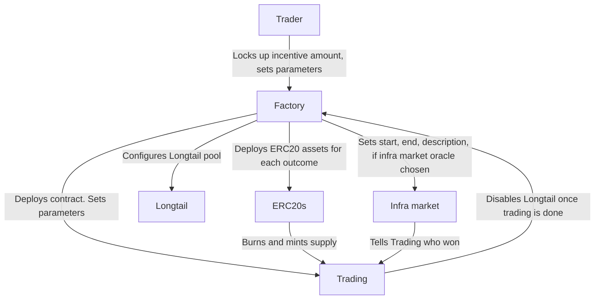

# 9Lives

9Lives is an Arbitrum Stylus smart contract implemented with a simple factory/pair
pattern. A factory takes a list of outcomes, and creates a variable number of contracts
with a minimal viable proxy pointing to share ERC20s, and a trading contract.

Inventors create campaigns (the prediction markets) by locking up "incentive" amounts, and
by picking the type of oracle they want to use. Any fees earned in the campaign are sent
to the Inventor, which provides incentive to create markets. Markets must be created with
a hard deadline and a Beauty Contest or a Infrastructure Market, or with a Contract
Interaction type of outcome. The Inventor must communicate to the Factory which oracle
they would like to use, and provide the hash of the string that must be used to determine
the outcome. This will then set the correct behaviour.

Infra Markets are prediction markets where Staked ARB is locked up as LARB, which is used
to predict the outcome of another prediction market with a commit and reveal scheme. These
markets exist in an optimistic state where anyone can "call" the outcome, before being
challenged with a "whinge", which begins the process of a commit and reveal system.
Following this, amounts can be claimed with a slashing process based on amounts staked.

Oracle State oracles are very simple comparatively, as presumably the associated Trading
contract was configured to allow early activation, so all a caller must do is activate the
associated Oracle State contract. These could communicate with LayerZero to pull
information from another chain, and the contract will simply check the result of the
message. If it's not activated by the date that's given, then it defaults to a "DEFAULT"
clause that could be "no" if a user were to try to estimate the price of something.

---

## Roadmap

- [X] UX improvements (shares are more visible, smart account behaviour)
- [X] Mainnet is supported as well. Mainnet has disclosure that funds are locked up until the election is over.
- Achievements and portfolio page is supported. Some socialfi elements.
    1. [ ] Users can choose their favourite achievements to display in a minified form next to their Meow Domain.
    2. [ ] Meow domains is supported in the UI.
- [X] Collect payoff from the campaign ending in the frontend.
- [X] Custom fee collection and pool configuration supported (use beauty contest with fixed date, many outcomes if they want)
- Anyone can create pools. Custom display of pools a la Ebay customisation.
    1. [X] A fixed fee is sent to creator of when shares are created.
    2. [X] Behind the scenes deferring to the AMM model if more than two outcomes.
    3. [ ] Customise the UI of the frontpage for the info
    4. [ ] Stack ranking is done for automated updating of frontpage
    5. [ ] Campaign report functionality. Images are screened automatically for bad content with CSAM
    6. [ ] API to update campaign by the original sender
    9. [ ] Custom embed when sharing URL
- [ ] Prediction market DAO. Token launch

## Building contracts

	make build

## Updating docs (after editing markdown files)

	forge doc -b

## Testing

Testing must be done with no trading or contract feature enabled. Testing is only possible
on the local environment, or with end to end tests with an Arbitrum node.

	./tests.sh

Interrogation of the deployment in the end to end testing library could be done using the
`build.rs` use of `environment.lst`, which could be in turn read with a fresh deploy (and
a clean artifacts directory):

	sort $(find target -name environment.lst) | uniq

You could clear the recorded environment variables the same way with a test harness:

	rm $(find target -name environment.lst)

You could use this to test the code by making a debug build, which includes more
information about reverts, then simulate your calldata against it using
`stylus-interpreter`, making debugging a breeze.

## Errors

This table is a helpful reference for the types of errors the contracts might produce. To
generate these, run `./print-error-table.sh`.

| Error name                    | Error hex                                                                                                                                                                                      |
|-------------------------------|------------------------------------------------------------------------------------------------------------------------------------------------------------------------------------------------|
| AlreadyConstructed            | 0x999000                                                                                                                                                                                       |
| MustContainOutcomes           | 0x999001                                                                                                                                                                                       |
| OddsMustBeSet                 | 0x999002                                                                                                                                                                                       |
| U256TooLarge                  | 0x999003                                                                                                                                                                                       |
| TooSmallNumber                | 0x999004                                                                                                                                                                                       |
| TooBigNumber                  | 0x999005                                                                                                                                                                                       |
| NegNumber                     | 0x999006                                                                                                                                                                                       |
| LongtailError                 | 0x9900                                                                                                                                                                                         |
| ShareError                    | 0x9902                                                                                                                                                                                         |
| ERC20ErrorTransfer            | 0x99010000000000000000000000000000000000000000                                                                                                                                                 |
| TradingError                  | 0x9903                                                                                                                                                                                         |
| ERC20UnableToUnpack           | 0x99900b                                                                                                                                                                                       |
| ERC20ReturnedFalse            | 0x99900c                                                                                                                                                                                       |
| NotOracle                     | 0x99900d                                                                                                                                                                                       |
| DoneVoting                    | 0x99900e                                                                                                                                                                                       |
| NotTradingContract            | 0x99900f                                                                                                                                                                                       |
| NotWinner                     | 0x999010                                                                                                                                                                                       |
| NegU256                       | 0x999011                                                                                                                                                                                       |
| CheckedPowOverflow            | 0x999012                                                                                                                                                                                       |
| CheckedMulOverflow            | 0x999013                                                                                                                                                                                       |
| CheckedAddOverflow            | 0x999014                                                                                                                                                                                       |
| CheckedSubOverflow            | 0x999015                                                                                                                                                                                       |
| CheckedDivOverflow            | 0x999016                                                                                                                                                                                       |
| TwoOutcomesOnly               | 0x999017                                                                                                                                                                                       |
| Infinity                      | 0x999018                                                                                                                                                                                       |
| NegativeFixedToUintConv       | 0x999019                                                                                                                                                                                       |
| UnusualAmountCreated          | 0x99901a                                                                                                                                                                                       |
| SqrtOpNone                    | 0x99901b                                                                                                                                                                                       |
| ERC20ErrorTransferFrom        | 0x99040000000000000000000000000000000000000000000000000000000000000000000000000000000000000000000000000000000000000000000000000000000000000000000000000000000000000000000000000000000000000000 |
| ERC20ErrorPermit              | 0x99050000000000000000000000000000000000000000                                                                                                                                                 |
| ERC20ErrorBalanceOf           | 0x99060000000000000000000000000000000000000000                                                                                                                                                 |
| ZeroShares                    | 0x99901f                                                                                                                                                                                       |
| CamelotError                  | 0x999020                                                                                                                                                                                       |
| BadSeedAmount                 | 0x999021                                                                                                                                                                                       |
| LockedARBError                | 0x99070000000000000000000000000000000000000000                                                                                                                                                 |
| LockedARBUnableToUnpack       | 0x999023                                                                                                                                                                                       |
| AlreadyRegistered             | 0x999024                                                                                                                                                                                       |
| NotFactoryContract            | 0x999025                                                                                                                                                                                       |
| NotInfraMarket                | 0x999026                                                                                                                                                                                       |
| InfraMarketHasNotStarted      | 0x999027                                                                                                                                                                                       |
| InfraMarketTooMuchVested      | 0x999028                                                                                                                                                                                       |
| InfraMarketHasExpired         | 0x999029                                                                                                                                                                                       |
| LockupError                   | 0x99902a                                                                                                                                                                                       |
| NotInsideSweepingPeriod       | 0x99902b                                                                                                                                                                                       |
| IncorrectSweepInvocation      | 0x99902c                                                                                                                                                                                       |
| UserAlreadyTargeted           | 0x99902d                                                                                                                                                                                       |
| InfraMarketWindowClosed       | 0x99902e                                                                                                                                                                                       |
| IsShutdown                    | 0x99902f                                                                                                                                                                                       |
| FactoryCallError              | 0x9907                                                                                                                                                                                         |
| FactoryCallUnableToUnpack     | 0x999031                                                                                                                                                                                       |
| CallerIsNotFactory            | 0x999032                                                                                                                                                                                       |
| NotEnabled                    | 0x999033                                                                                                                                                                                       |
| LockupUnableToUnpack          | 0x999034                                                                                                                                                                                       |
| BadVictim                     | 0x999035                                                                                                                                                                                       |
| VictimCannotClaim             | 0x999036                                                                                                                                                                                       |
| NoVestedPower                 | 0x999037                                                                                                                                                                                       |
| ZeroAmount                    | 0x999038                                                                                                                                                                                       |
| InfraMarketCallError          | 0x9908                                                                                                                                                                                         |
| NinelivesLockedArbCreateError | 0x99903a                                                                                                                                                                                       |
| NonexistentOutcome            | 0x99903b                                                                                                                                                                                       |
| DeployError                   | 0x99903c                                                                                                                                                                                       |
| CalledTimeUnset               | 0x99903d                                                                                                                                                                                       |
| WhingedTimeUnset              | 0x99903e                                                                                                                                                                                       |
| NotInsideCallingPeriod        | 0x99903f                                                                                                                                                                                       |
| CampaignAlreadyCalled         | 0x999040                                                                                                                                                                                       |
| PredictingNotStarted          | 0x999041                                                                                                                                                                                       |
| InCallingPeriod               | 0x999042                                                                                                                                                                                       |
| SomeoneWhinged                | 0x999043                                                                                                                                                                                       |
| WinnerAlreadyDeclared         | 0x999044                                                                                                                                                                                       |
| NotInWhingingPeriod           | 0x999045                                                                                                                                                                                       |
| PreferredOutcomeIsZero        | 0x999046                                                                                                                                                                                       |
| AlreadyWhinged                | 0x999047                                                                                                                                                                                       |
| OutcomeDuplicated             | 0x999048                                                                                                                                                                                       |
| NotPastDeadline               | 0x999049                                                                                                                                                                                       |
| ZeroDesc                      | 0x99904a                                                                                                                                                                                       |
| ZeroTradingAddr               | 0x99904b                                                                                                                                                                                       |
| NotRegistered                 | 0x99904c                                                                                                                                                                                       |
| NotOperator                   | 0x99904d                                                                                                                                                                                       |
| TradingEmpty                  | 0x99904e                                                                                                                                                                                       |
| TradingUnableToUnpack         | 0x99904f                                                                                                                                                                                       |
| BeautyContestBadOutcomes      | 0x999050                                                                                                                                                                                       |
| BelowThreeHourBuyin           | 0x999051                                                                                                                                                                                       |
| NoDAOMoney                    | 0x999052                                                                                                                                                                                       |
| ZeroCallDeadline              | 0x999053                                                                                                                                                                                       |
| InconclusiveAnswerToCall      | 0x999054                                                                                                                                                                                       |
| PastCallingDeadline           | 0x999055                                                                                                                                                                                       |
| CannotEscape                  | 0x999056                                                                                                                                                                                       |
| NotAfterWhinging              | 0x999057                                                                                                                                                                                       |
| NotInCommitReveal             | 0x999058                                                                                                                                                                                       |
| CommitNotTheSame              | 0x999059                                                                                                                                                                                       |
| AlreadyRevealed               | 0x99905a                                                                                                                                                                                       |
| NotAllowedZeroCommit          | 0x99905b                                                                                                                                                                                       |
| ZeroBal                       | 0x99905c                                                                                                                                                                                       |
| StakedArbUnusual              | 0x99905d                                                                                                                                                                                       |
| TooEarlyToWithdraw            | 0x99905e                                                                                                                                                                                       |
| VictimLowBal                  | 0x99905f                                                                                                                                                                                       |
| CampaignWinnerSet             | 0x999060                                                                                                                                                                                       |
| OutcomesEmpty                 | 0x999061                                                                                                                                                                                       |
| InvalidEpoch                  | 0x999062                                                                                                                                                                                       |
| PotAlreadyClaimed             | 0x999063                                                                                                                                                                                       |
| CampaignZeroCaller            | 0x999064                                                                                                                                                                                       |
| WinnerUnset                   | 0x999065                                                                                                                                                                                       |
| BadWinner                     | 0x999066                                                                                                                                                                                       |
| CantWhingeCalled              | 0x999067                                                                                                                                                                                       |
| NotReadyToDeclare             | 0x999068                                                                                                                                                                                       |
| AlreadyCommitted              | 0x999069                                                                                                                                                                                       |
| DPMOnly                       | 0x99906a                                                                                                                                                                                       |
## Deployments

### Superposition mainnet

|        Deployment name        |              Deployment address            |
|-------------------------------|--------------------------------------------|
| Proxy admin                   | `0x6221A9c005F6e47EB398fD867784CacfDcFFF4E7` |
| Factory 1 implementation      | `0x3302ac14ad6b38baf789571395cc3a54f0f65e52` |
| Factory 2 implementation      | `0xb1e52886e1346138ca1cede98c1a41dbff0fde9b` |
| Lockup implementation         | `0x99596b476d5e16e4a30bd4858dd289a763671294` |
| Optimistic infra predict impl | `0xf94aeb587d332d0e7f2f1e2c87ffea1385ff0505` |
| Trading DPM mint impl         | `0x824f4547cf245798472bbb2be4fb1f58a35be940` |
| Trading DPM extras impl       | `0xbf602e27fc343fd7833e5b23f705c9ab1b545b74` |
| Trading DPM price impl        | `0x8fc31d39edec596e8089b313920c05642e86d549` |
| Trading DPM quotes impl       | `0x7439ec52bd28c21f59b07a7a12a09c1f7feac7cf` |
| Trading AMM mint impl         | `0x75a1561702de3a5bb5ae07ef0106a085a38b9369` |
| Trading AMM extras impl       | `0xb73ceaf59fe6d13792153ee73ab2474de8c6df10` |
| Trading AMM price impl        | 0xe8e2e4ac62b89a8b0e0632fd9f19316b8b2af76e`` |
| Trading AMM quotes impl       | `0x1086fe3c7a453e31d5f04a55924ec633b62157d9` |
| Share implementation          | `0x3e27e934344bf490457231Cb8F0c0eda7d60C362` |
| Lockup token implementation   | `0x70143C674A23a43Ad487D33c4035Ba1D012ac598` |
| Infrastructure market proxy   | `0xc4451d8477cd6b92bfa0d3e2662ce0507a8e10b9` |
| Lockup proxy                  | `0x20d2360706086ec9814d15a52ad2d2aec2c43caa` |
| Lockup token proxy            | `0x14c35ba87e8b490761f492382c9249867b82aaf4` |
| Factory proxy                 | `0x7dfe1fa7760131140cfc48b3ea99719203d8f00b` |
| Helper factory                | `0xFA9B2A004F639bf27612B8dcd4cf4D47d1191d33` |
| LensesV1                      | `0xa6f3dEBce04728d7a43224F051F03976c998CF83` |
| Beauty contest                | `0xb8379ec062a44a1ef308d01ddf27935976df52ad` |
| Sarp AI Resolver              | `0x9d73847f1edc930d2a2ee801aeadb4c4567f18e1` |
| Helper factory                | `0xE307205f1558aCE077EADb57DD9e1D4cFf4D3CC8` |
| Buy helper2                   | `0x98E5fEe28CB760A9a97391F319536175700D7524` |
| SARP Signaller                | `0xa0Dc021Cbf8fe4062533D3Ee126Cc1a6Ab43C90d` |

### Superposition testnet

|        Deployment name        |              Deployment address            |
|-------------------------------|--------------------------------------------|
| Proxy admin                   | `0xfeb6034fc7df27df18a3a6bad5fb94c0d3dcb6d5` |
| Infrastructure market proxy   | `0x8aa856892f4c4110c3f2746d77530a8cde24189b` |
| Lockup proxy                  | `0xedeb60590daf463b551295ceb57cfc7cf7f29491` |
| Lockup token proxy            | `0x2ed6450b4d48f049364676021e09ed39d59de62f` |
| Factory proxy                 | `0xae011e461867e825268cc3df5fa06649809828e5` |
| Helper factory                | `0xc401FCa17FdD967620a9cFC989ce2A33D22059ca` |
| LensesV1                      | `0x76Fa8ea53cd6C5491496B1aEdf4F69F0E0506311` |
| Beauty contest                | `0xf015ea35e410389aea6a6261db3b59f91ba9764c` |
| Sarp AI Resolver              | `0x0000000000000000000000000000000000000000` |
| Buy helper                    | `0xfCA868F1a7CF8B829ADDBbf3A703Af4a57ebfCFF` |
