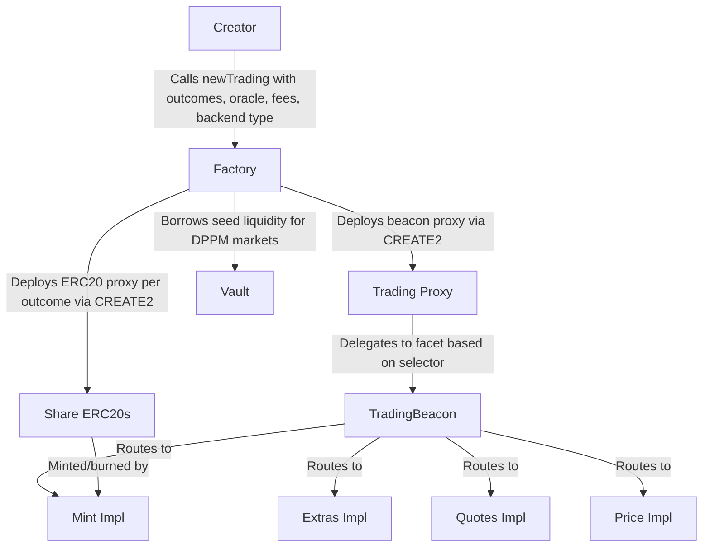

# 9lives

9lives is a prediction market protocol built on [Arbitrum Stylus](https://docs.arbitrum.io/stylus/gentle-introduction), supporting both a Dynamic Pari-Mutuel Prediction Market (DPPM) model and a Constant Product AMM model. The core contracts are written in Rust and compiled to WASM, with supporting Solidity contracts for proxies, the Vault, and the TradingBeacon.

If you're interested in running prediction markets using 9lives (including hosted graph infrastructure), reach out via [this form](https://docs.google.com/forms/d/e/1FAIpQLSfYfgLuQ0GU8K5vGj-kU0PciqHHQCCD60T7NHtLLmewkNvldg/viewform?usp=dialog).

---

## How the contracts work

The system follows a **factory/proxy** pattern. The Factory deploys Trading contract proxies and Share ERC20 proxies for each market. Each Trading contract is a beacon proxy that delegates calls to one of four implementation facets (mint, extras, quotes, price) based on the function selector, looked up via the [TradingBeacon](src/TradingBeacon.sol). There are separate implementations for DPPM and AMM backends, selected at deploy time.


```mermaid
flowchart TD
    Creator -->|Calls newTrading with outcomes, oracle, fees, backend type| Factory
    Factory -->|Deploys beacon proxy via CREATE2| TradingProxy[Trading Proxy]
    Factory -->|Deploys ERC20 proxy per outcome via CREATE2| ShareERC20s[Share ERC20s]
    Factory -->|Borrows seed liquidity for DPPM markets| Vault
    TradingProxy -->|Delegates to facet based on selector| TradingBeacon
    TradingBeacon -->|Routes to| MintImpl[Mint Impl]
    TradingBeacon -->|Routes to| ExtrasImpl[Extras Impl]
    TradingBeacon -->|Routes to| QuotesImpl[Quotes Impl]
    TradingBeacon -->|Routes to| PriceImpl[Price Impl]
    ShareERC20s -->|Minted/burned by| MintImpl
```

### Contract facets

Each Trading contract is split into four facets, each compiled as a separate WASM binary with either the `trading-backend-dppm` or `trading-backend-amm` feature flag. The [TradingBeacon](src/TradingBeacon.sol) maps function selectors to the correct facet address using a byte in the selector:

| Facet | Responsibility | Key functions |
|-------|---------------|---------------|
| **Mint** ([`contract_trading_mint.rs`](src/contract_trading_mint.rs)) | Buying and selling shares | `mint`, `burn` (AMM only) |
| **Extras** ([`contract_trading_extras.rs`](src/contract_trading_extras.rs)) | Constructor, state queries, deciding outcomes | `ctor`, `decide`, `details`, `share_addr`, `outcome_list` |
| **Quotes** ([`contract_trading_quotes.rs`](src/contract_trading_quotes.rs)) | Quoting prices, payoffs, fee queries | `quote`, `payoff`, `fees`, `estimate_burn` |
| **Price** ([`contract_trading_price.rs`](src/contract_trading_price.rs)) | Current prices, liquidity management, fee claiming | `price`, `add_liquidity`, `remove_liquidity`, `claim_all_fees` |

### Trading backends

**DPPM** (Dynamic Pari-Mutuel Prediction Market) -- implemented in [`trading_dppm.rs`](src/trading_dppm.rs):
- Supports exactly 2 outcomes
- Seed liquidity is borrowed from the [Vault](src/Vault.sol) at creation time and repaid at resolution
- Share prices are determined by the ratio of funds invested in each outcome
- Includes a "Ninetails" time-weighted bonus: earlier buyers receive boosted shares that entitle them to a larger portion of the losing side's funds
- Only whitelisted creator addresses (`DPPM_HOUR_CREATOR_ADDR`, `DPPM_15_MIN_CREATOR_ADDR`, `DPPM_5_MIN_CREATOR_ADDR`) can create DPPM markets
- No selling/burning of shares -- positions are held until resolution

**AMM** (Automated Market Maker) -- implemented in [`trading_amm.rs`](src/trading_amm.rs):
- Supports 2+ outcomes
- Uses a constant-product invariant across outcome share pools
- Liquidity providers can add/remove liquidity and earn fees
- Shares can be both minted (bought) and burned (sold) before resolution
- A "shortterm AMM" variant exists for markets using the price resolver oracle, where the Vault provides and reclaims liquidity at resolution

### Supporting contracts

**Vault** ([`Vault.sol`](src/Vault.sol)):
- A shared liquidity pool that lends seed capital to DPPM markets at creation and is repaid at resolution
- For DPPM: the Factory calls `borrow()` at market creation; the Trading contract calls `repay()` at resolution, returning DAO-earned fees to cover the loan
- For shortterm AMM: the Factory calls `ammRegister()`; at resolution the Trading contract either calls `ammReceive()` (if there's a shortfall) or `ammGift()` (if there's a surplus)
- The operator can `drain()` excess funds above outstanding debt

**Share ERC20s** ([`Share.sol`](src/Share.sol)):
- Minimal ERC20 tokens deployed per outcome via CREATE2
- Minted/burned exclusively by the associated Trading contract
- The CREATE2 salt is derived from the trading address + outcome identifier, making addresses deterministic

**Factory** ([`contract_factory_1.rs`](src/contract_factory_1.rs), [`contract_factory_2.rs`](src/contract_factory_2.rs)):
- Split across two facets for code size reasons
- Factory 1: `newTrading` -- deploys trading proxies, share ERC20s, seeds liquidity, registers with oracles
- Factory 2: constructor, admin functions, address lookups, legacy compatibility methods

### Fee structure

Fees are configured per-market at creation time (each capped at <10%):

| Fee | Recipient | Description |
|-----|-----------|-------------|
| Creator fee | Market creator (`fee_recipient`) | Incentive for creating markets |
| LP fee | Liquidity providers (AMM only) | Reward for providing liquidity |
| Minter fee | Protocol (`DAO_EARN_ADDR`) | Protocol revenue |
| Referrer fee | Referrer address | Paid when a referrer is specified on mint |
| Protocol fee | Protocol | Fixed 0.8% on all mints |

---

## Project structure

```
src/
  lib.rs                          # Crate root, feature-gated entrypoint selection
  contract_factory_1.rs           # Factory: market creation (newTrading)
  contract_factory_2.rs           # Factory: admin, queries, legacy compat
  storage_factory.rs              # Factory storage layout
  contract_trading.rs             # Trading: feature gate that selects the active facet
  contract_trading_mint.rs        # Trading facet: mint/burn shares
  contract_trading_extras.rs      # Trading facet: ctor, state, decide
  contract_trading_quotes.rs      # Trading facet: quotes, payoff, fees
  contract_trading_price.rs       # Trading facet: price, liquidity, fee claiming
  contract_trading_extras_admin.rs # Trading facet: admin-only operations
  contract_trading_dumper.rs      # Trading facet: emergency dumper
  storage_trading.rs              # Trading storage layout
  trading_dppm.rs                 # DPPM backend: mint, payoff, price logic
  trading_amm.rs                  # AMM backend: mint, burn, liquidity, price logic
  trading_private.rs              # Shared trading internals: ctor, decide, fees, shutdown
  immutables.rs                   # Compile-time addresses and constants
  fees.rs                         # Fee constants (bonds, incentives, protocol %)
  maths.rs                        # Math helpers (DPPM share calc, sqrt, mul_div)
  proxy.rs                        # CREATE2 proxy deployment helpers
  error.rs                        # Error types and codes (see ERRORS.md)
  events.rs                       # Event definitions
  Vault.sol                       # Vault: shared liquidity pool (Solidity)
  TradingBeacon.sol               # Beacon: maps selectors to facet impls (Solidity)
  Share.sol                       # Share ERC20 (Solidity, compiled with Foundry)
  NineLivesPaymaster.sol          # Paymaster for gasless transactions (Solidity)
tests/                            # Property tests, e2e tests, reference implementations
db/                               # Database migrations (PostgreSQL)
cmd/                              # Backend services (Go): GraphQL API, ingestor, paymaster, etc.
web/                              # Frontend (TypeScript)
```

### Feature flags

Each contract facet is compiled as a separate WASM binary using Cargo feature flags. Exactly one `contract-*` feature must be enabled per build, and trading facets additionally require either `trading-backend-dppm` or `trading-backend-amm`:

| Feature | Contract |
|---------|----------|
| `contract-factory-1` | Factory (market creation) |
| `contract-factory-2` | Factory (admin/queries) |
| `contract-trading-mint` + `trading-backend-dppm` | DPPM mint facet |
| `contract-trading-mint` + `trading-backend-amm` | AMM mint facet |
| `contract-trading-extras` + backend | Extras facet |
| `contract-trading-quotes` + backend | Quotes facet |
| `contract-trading-price` + backend | Price facet |
| `testing` | Required for non-WASM builds (unit/property tests) |

---

## Building

Build all contract WASM binaries and Solidity artifacts:

```sh
make build
```

This compiles each facet separately (see the [Makefile](Makefile) for the full list of targets). Solidity contracts are built with Foundry:

```sh
forge build
```

### Environment variables

The Rust contracts read deployment addresses at compile time from environment variables (see [`immutables.rs`](src/immutables.rs)). Key variables include:

- `SPN_FUSDC_ADDR` -- fUSDC token address
- `SPN_STAKED_ARB_ADDR` -- Staked ARB token address
- `SPN_TRADING_BEACON_ADDR` -- TradingBeacon contract address
- `SPN_VAULT_ADDR` -- Vault contract address
- `SPN_SHARE_IMPL_ADDR` -- Share ERC20 implementation address
- `SPN_DAO_EARN_ADDR` -- DAO fee recipient
- `SPN_DAO_OP_ADDR` -- DAO operator (admin)

See [`immutables.rs`](src/immutables.rs) for the full list. When the `testing` feature is enabled, these are replaced with hardcoded test addresses from [`testing_addrs.rs`](src/testing_addrs.rs).

## Testing

Unit and property tests run natively (not in WASM). The `testing` feature must be enabled:

```sh
./tests.sh
```

Mutation testing with `cargo-mutants` and `cargo-nextest` (slow, resource-intensive):

```sh
./mutants.sh
```

`PROPTEST_CASES` controls the number of property test iterations (default in CI: 10, proptest default: 256).

End-to-end tests in `tests/` use a bespoke harness that deploys contracts to a local Arbitrum node. The `build.rs` script reads `environment.lst` files to track deployment addresses:

```sh
# List all recorded environment variables from a fresh deploy
sort $(find target -name environment.lst) | uniq

# Clear recorded variables
find target -name environment.lst -delete
```

For debugging reverts, build with debug info and use `stylus-interpreter` to simulate calldata against the WASM binary.

## Errors

See [ERRORS.md](ERRORS.md) for the full error code table. Generate it with:

```sh
./print-error-table.sh
```

## Audits

- [Dadekuma (December 2024)](audits/Dadekuma-12-2024.pdf)
- [OpenZeppelin (November 2025)](audits/OpenZeppelin-11-2025.pdf)

See [audits/README.md](audits/README.md) for details.

## Deployments

### Arbitrum mainnet

|        Deployment name        |              Deployment address            |
|-------------------------------|--------------------------------------------|
| Proxy admin                   | `0x58A5f520FF7A6F59863e8a73b066A975799d5d48` |
| Emergency council             | `0x6221a9c005f6e47eb398fd867784cacfdcfff4e7` |
| Trading DPPM mint impl        | `0x0000000000000000000000000000000000000000` |
| Trading DPPM extras impl      | `0x0000000000000000000000000000000000000000` |
| Trading DPPM quotes impl      | `0x0000000000000000000000000000000000000000` |
| Trading DPPM price impl       | `0x0000000000000000000000000000000000000000` |
| Trading AMM mint impl         | `0xd596980809661b029b9c414b17d29dd5606eefeb` |
| Trading AMM extras impl       | `0x001da572372fbda0bf9db37116bcf8fc99930e05` |
| Trading AMM quotes impl       | `0x971428d8579a8462f07c2ebc3e01f491b07ed152` |
| Trading AMM price impl        | `0x5b60a793bccac54a2430420e6e8cc814e97ad85e` |
| Share implementation          | `0x87f03D061C1e92802e2A9969E93Ff30f0C178230` |
| Factory proxy                 | `0x90234c942f335df8c055b9c1a2e0babf060a31ad` |
| Helper factory                | `0x263735150e8b48FF6bF471DB94f113e9994C333d` |
| Trading beacon                | `0x5F2BD61Bb7e4a8008e0725F8AbB977cbe41FcfD5` |
| LensesV1                      | `0xF0dd060f469A2445736Df0EAE97e24113faCe0d6` |
| Sarp AI Resolver              | `0xa81a0adab3492dae14c45c39d322a78a24c8b683` |
| Claimant helper               | `0xf8Da8d65120b317331C79092Bf65e99bed6e65dE` |
| Paymaster                     | `0xA19B3a76d5744825c3672a5FFE1F4F5Aee3F28dE` |
| Paymaster caller              | `0x132abdc1eca9b55a2ce3a48cec4a3d443301dc06` |
| USDC                          | `0xaf88d065e77c8cC2239327C5EDb3A432268e5831` |
| Camelot swap router           | `0x1f721e2e82f6676fce4ea07a5958cf098d339e18` |
| Stargate                      | `0xe8CDF27AcD73a434D661C84887215F7598e7d0d3` |
| WETH                          | `0x82af49447d8a07e3bd95bd0d56f35241523fbab1` |
| DPPM hour creator             | `0xF42cC58DA660e0f04e318372280ECCc26733757c` |
| DPPM 15 min creator           | `0xF42cC58DA660e0f04e318372280ECCc26733757c` |
| DPPM 5 min creator            | `0xF42cC58DA660e0f04e318372280ECCc26733757c` |
| Oracle                        | `0xA2cFa0E8dD8abD255343c9ab6D36f3306Ad3A6aB` |
| Buy helper                    | `0xAa901219528e22aC1E3a3bDc40a34Eab7983d240` |
| Vault                         | `0xE45C182512e18982522B620EDfF0D9C56c294C08` |

### Superposition mainnet

|        Deployment name        |              Deployment address              |
|-------------------------------|----------------------------------------------|
| Proxy admin                   | `0x6221A9c005F6e47EB398fD867784CacfDcFFF4E7` |
| Factory 1 implementation      | `0x47d8ffc6e491b7ef8c126555264cceed0ea6caa6` |
| Factory 2 implementation      | `0xa7c8c010d32e2316637636265a4d137b9bb1bf03` |
| Lockup implementation         | `0x99596b476d5e16e4a30bd4858dd289a763671294` |
| Optimistic infra predict impl | `0xf94aeb587d332d0e7f2f1e2c87ffea1385ff0505` |
| Trading DPPM mint impl        | `0x17769631bf02c6d1455f2cd46282242decd0cbb0` |
| Trading DPPM extras impl      | `0x7289a31ca767883d6ad711e634c2591a16e6ef74` |
| Trading DPPM price impl       | `0xb6c29b66bb663f3cd6a733b77927ba09cefa8d5a` |
| Trading DPPM quotes impl      | `0xa516f91f100cbd796d2351acbf11f857402d2204` |
| Trading AMM mint impl         | `0x7596b33a6842585d6a11162b9c54e9ecc7fda0ce` |
| Trading AMM extras impl       | `0x7d9e78370cc8f8124b0cad7b9fa87b7f424a839c` |
| Trading AMM price impl        | `0x3be11d59fe73c0b516f821ec4ea6d37499e68a65` |
| Trading AMM quotes impl       | `0x097e45ee7a05e470ee7c884d558cfb4ad0d3cf87` |
| Share implementation          | `0x3e27e934344bf490457231Cb8F0c0eda7d60C362` |
| Lockup token implementation   | `0x70143C674A23a43Ad487D33c4035Ba1D012ac598` |
| Infrastructure market impl    | `0x863642e21a45e824c4f6347a5757e5dcacae11c1` |
| Infrastructure market proxy   | `0xc4451d8477cd6b92bfa0d3e2662ce0507a8e10b9` |
| Lockup proxy                  | `0x20d2360706086ec9814d15a52ad2d2aec2c43caa` |
| Lockup token proxy            | `0x14c35ba87e8b490761f492382c9249867b82aaf4` |
| Factory proxy                 | `0x7dfe1fa7760131140cfc48b3ea99719203d8f00b` |
| Helper factory                | `0x5Da3fC34FFF02faaDDf71eD6C0Bc9928C747f8fE` |
| LensesV1                      | `0x8036d656D2E0c36d90DF47b7Da625fDC16375f87` |
| Beauty contest implementation | `0xb7f978f707dc03b392d7215426cf98dc812d9454` |
| Beauty contest proxy          | `0x15f4A8a0b8cD0343fAe5a7FC736cD9e0D7bE4d5C` |
| Sarp AI Resolver              | `0x9d73847f1edc930d2a2ee801aeadb4c4567f18e1` |
| Helper factory                | `0x937AB18278f8a11D1E7129f58A3Cdb026A16aD5a` |
| BuyHelper2                    | `0x7aD7eDd9A72512335e2A7A980047Ec2eD233D21c` |
| SARP Signaller                | `0xD608CeF1D7C84feaA0E1520C7a6BC4798cFC1455` |
| Extras beacon proxy factory   | `0x6c1cf52961C567965AFCf495B7af7eCC81411598` |
| Claimant helper for claim     | `0xD77ae359A5A12F04c4ABFE7D5B511E0990CE6F6C` |
| Paymaster implementation      | `0x552BbaEc8D75c010435C810fA890B3E03e9C6445` |
| Paymaster proxy               | `0xE990f05e2264f56435Fd7589FA2F70A879B0cE9f` |
| Stargate                      | `0x8EE21165Ecb7562BA716c9549C1dE751282b9B33` |
| Price resolver oracle         | `0xa2cfa0e8dd8abd255343c9ab6d36f3306ad3a6ab` |
| Trading beacon                | `0xfA433744C5C496c7caD243c61A17167DD39AE8ee` |
| Vault implementation          | `0xA1eBA7dD250e587BdA34737aA43b6F1ad3A21Bf8` |
| Vault proxy                   | `0x0EdAbfd36c57555A85f1db1665BF8beF60F42F14` |

Several "precompiles" are in use, provided by superposition-precompiles.

## License

See [LICENSE](LICENSE).
