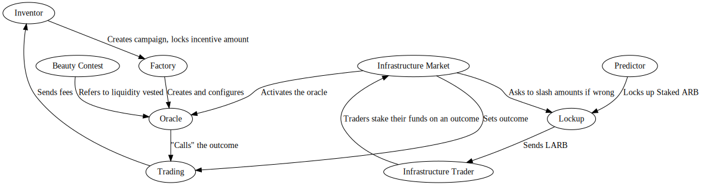

# 9Lives

9Lives is an Arbitrum Stylus smart contract implemented with a simple factory/pair
pattern. A factory takes a list of outcomes, and creates a variable number of contracts
with a minimal viable proxy pointing to share ERC20s, and a trading contract.

It allows a protocol-sanctioned address to determine which outcome came to reality,
then share holders can convert their positions to fUSDC on request.

## Building contracts

	make build

## Updating docs (after editing markdown files)

	forge doc -b

## Testing

Testing must be done with no trading or contract feature enabled. Testing is only possible
on the local environment, or with end to end tests with an Arbitrum node.

	./tests.sh

## Deployments

### Superposition testnet

|      Deployment name     |              Deployment address            |
|--------------------------|--------------------------------------------|
| Proxy admin              |  |
| Factory 1 implementation | 0xe445e9ed21D0c33B84C8c6f17556524986d9001A |
| Factory 2 implementation | 0x8268D125A22db96Fc88c2EA79FB50eF3051e667e |
| ERC20 implementation     | 0x29E7d600131645e60977B15D7a69a3c6F275FF81 |
| Trading mint impl        | 0xe3A5Fa55827ed570dABFFB4808E18c91E98A4358 |
| Trading extras impl      | 0x3988bcdC07892802D23569fC93DcB352dD90B88F |
| Factory proxy            | 0x9329840D3cc38B95c3CD103ff62873bf6F4f6c35 |
| LensesV1                 | 0xB6ce369f7C4c29a6fe707b8eDe7A1547D63A0A7b |
